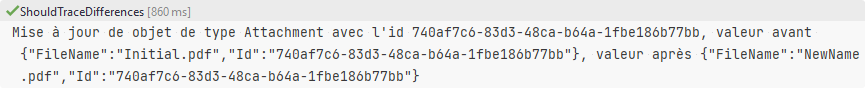

# Pattern decorator pour tracer les changements dans un repository

Le test ShouldTraceDifferences écrit le traces qui sont envoyées au logger



La classe ```RepositoryWithEntityDifferenceTrace<T>``` décore les classes qui implémentent ```IRepository<T>```.
Elle est utilisée dans le test pour décorer ```AttachmentRepository``` mais peut être utiliser pour décorer tout autre implémentation de  ```IRepository<T>```.